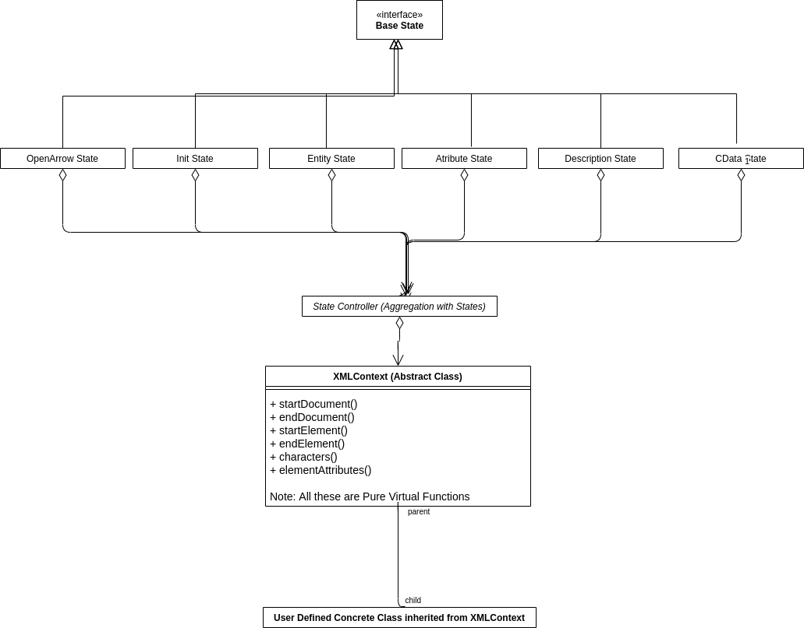

# XMLParser
A simple XML parser (SAX Style) being written in C++

## Instructions to Build the project
1) Assuming you are in the root folder of the project i.e. XMLParser/ and on a unix machine
2) mkdir Build
3) cd build
4) Run the build configuration.
5) Run make to generate the executable.

## Build Configurations
      
       cmake -D CMAKE_CXX_COMPILER="/usr/bin/g++" ../  
       
## Program Execution:
           
       ./ParserEngine.exe {path to the xml file} 

## Class Diagram


## Folder Structure:
```
src/
├── XMLParser.h
├── XMLParser.cpp (An Example class inherited from XMLContext)
├── Attribute.cpp (State)
├── Entity.cpp (State)
├── OpenArrow.cpp (State)
├── Cdata.cpp (State)
├── Init.cpp (State)
├── EscapeHandler.cpp (State)
├── ContextClass.cpp (Class to be inherited by the user)
├── StateController.cpp ((State Controller Class)
├── Description.cpp (State)
├── MiscFunctions.cpp (MIscellaneous Functions)

data/ (Test Data for the executable)
